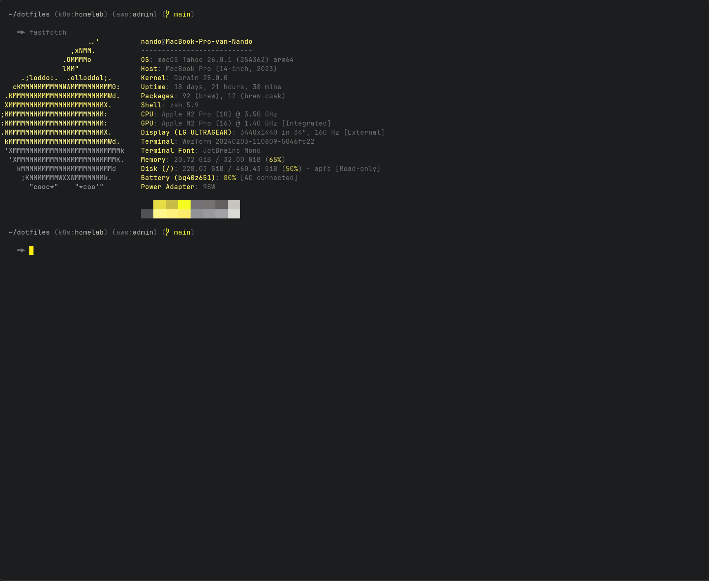

# dotfiles

My configuration, still a work in progess. These dotfiles are managed with [Stow](https://www.gnu.org/software/stow/).
I'm using this configuration on both MacOS and Windows (with WSL2 integration), using wezterm as my terminal emulator with tmux as terminal multiplexer

## neovim
You might be interested in my neovim config. That can be found [here](https://github.com/NandovdK/nvim).
